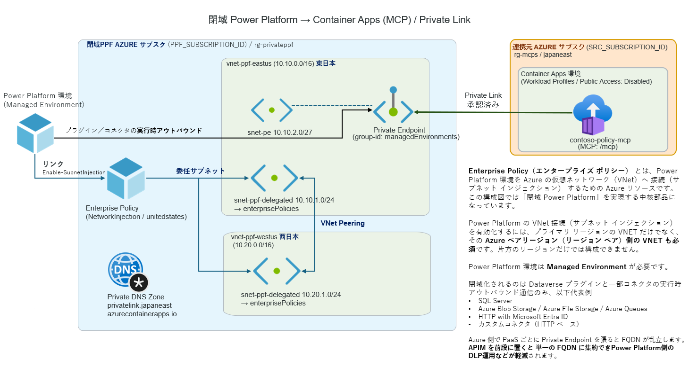
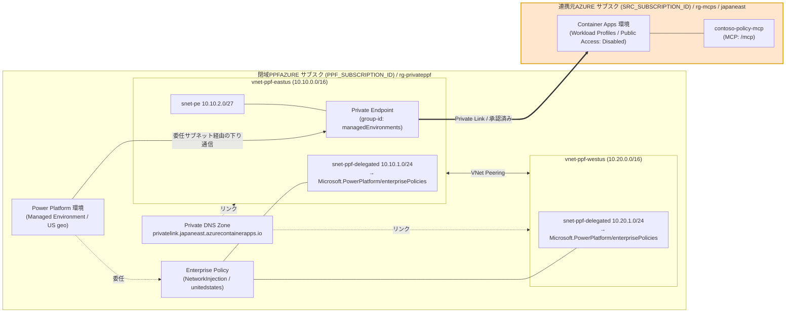

# private-PPF_Azure — Power Platform から「別テナント」の閉域 Azure へのプライベート接続構築

## 概要

本リポジトリの**一番の主目的は、テナントをまたいだ（マルチテナント）閉域接続**です。すなわち、
**Power Platform（Copilot Studio）環境が属するテナント**から、**別の Entra テナントにある Azure サービス**へ、
インターネットを経由せず **Private Endpoint（Private Link）経由でプライベート接続**するリファレンス構成をまとめています。

これを実現するために、Power Platform 側は **VNET 引き込み（サブネット委任）**でアウトバウンドを自社 VNET に固定し、
連携元の Azure サービス（本サンプルでは Azure Container Apps 上の MCP サーバー `contoso-policy-mcp`）はパブリックアクセスを無効化して閉域化します。
対象は次の 2 つの環境で、**両者は異なる Entra テナントに属します**。

- **閉域PPFAZURE環境（テナント `<PPF_TENANT_ID>`）** … Power Platform をホストするテナント／サブスクリプション。ペアリージョン（`eastus` / `westus`）双方に委任サブネット付き VNET を用意し、Enterprise Policy で環境にサブネット インジェクションを適用して、Power Platform のアウトバウンドをこの VNET 経由に引き込みます。
- **連携元AZURE環境（テナント `<SRC_TENANT_ID>` ＝別テナント）** … 連携元の Azure サービス（本サンプルでは Azure Container Apps 上の MCP サーバー `contoso-policy-mcp`）を持つ**別テナント**のサブスクリプション。パブリックアクセスを無効化して**サービス側を閉域化**し、閉域PPF側からの Private Endpoint 接続を**手動承認**します。

> **🎯 ここが要点（テナント境界の整理）**
> - **Power Platform 環境 ↔ VNET / Enterprise Policy を持つ閉域PPF側サブスク** … サブネット インジェクションの制約上、**必ず同一テナント（`<PPF_TENANT_ID>`）**である必要があります。
> - **閉域PPF側 ↔ 連携元AZURE（Private Endpoint 接続）** … Private Link は**クロステナント接続に対応**しているため、**連携元が別テナント（`<SRC_TENANT_ID>`）でも到達可能**です。PE 接続は連携元テナント側で**手動承認**します。
>
> つまり「同一テナントが必須なのは PP 環境と VNET/Enterprise Policy の側だけ」で、**接続先の Azure は別テナントでよい**、という点が本構成の核心です。

主な構成ポイント:

- **★ クロステナント（マルチテナント）の Private Link 引き込み**（連携元が別テナントでも、手動承認で PE 接続できる）
- **クロスサブスクリプション／クロスリージョンの Private Link 引き込み**（連携元が別サブスク・別リージョンでも到達可能）
- **US ジオグラフィのペアリージョン要件**（`eastus` + `westus` の委任サブネット + 双方向 VNet Peering）
- **Private DNS Zone による名前解決**（プライベート FQDN → Private Endpoint のプライベート IP）
- **Copilot Studio から PE 経由で MCP を利用**（Streamable HTTP `/mcp`）

サンプル MCP サーバー（返品／配送／支払い／ポイントのポリシーを返す 4 ツール）は `contso-mcp/` 配下にあります。

> 📚 **参考**: [Virtual Network のサポートの概要 — Power Platform | Microsoft Learn](https://learn.microsoft.com/ja-jp/power-platform/admin/vnet-support-overview)

## 本リポジトリを作成した目的

- **【主目的】Power Platform（及び Copilot Studio）環境が属するテナントと、連携先の Azure が属するテナントが異なる（マルチテナント）ケースで、両者を閉域（Private Endpoint）でつなぐ**ための解決方法として
- Power Platform（及び Copilot Studio）環境から Azure を経由することにより、Azure の Private Link 機能で Azure 以外のクラウドやオンプレミスと安全に連携するための解決方法として

---

> 📝 **プレースホルダについて**: 以降の `<...>` 表記（例 `<PPF_TENANT_ID>`）は環境ごとに異なる変動値です。実際の値に置き換えて使用してください。
>
> | プレースホルダ | 意味 |
> |---|---|
> | `<PPF_TENANT_ID>` / `<PPF_SUBSCRIPTION_ID>` | 閉域PPF側のテナント / サブスクリプション ID |
> | `<PPF_SUBSCRIPTION_NAME>` / `<PPF_ADMIN_UPN>` | 閉域PPF側のサブスク名 / 管理者 UPN |
> | `<SRC_TENANT_ID>` / `<SRC_SUBSCRIPTION_ID>` | 連携元側のテナント / サブスクリプション ID |
> | `<SRC_SUBSCRIPTION_NAME>` / `<SRC_ADMIN_UPN>` | 連携元側のサブスク名 / 管理者 UPN |
> | `<SRC_ACA_ENV_LABEL>` / `<ACA_ENV_LABEL>` | 連携元 / 閉域側 ACA 環境の既定ドメインラベル |
> | `<COPILOT_STUDIO_ENV_NAME>` / `<COPILOT_STUDIO_ENV_ID>` | Copilot Studio 環境の名前 / ID |
> | `<PE_PRIVATE_IP>` | Private Endpoint に割り当てられたプライベート IP |

## 閉域PPFAZURE環境テナント / サブスクリプション

| 項目 | 値 |
|---|---|
| テナント ID | `<PPF_TENANT_ID>` |
| サブスクリプション名 | `<PPF_SUBSCRIPTION_NAME>` |
| サブスクリプション ID | `<PPF_SUBSCRIPTION_ID>` |
| サインインユーザー | `<PPF_ADMIN_UPN>` |
| リソースグループ | `rg-privateppf` |
| リージョン | East US 2 (`eastus2`) |

---

## 連携元AZURE環境テナント / サブスクリプション

| 項目 | 値 |
|---|---|
| テナント ID | `<SRC_TENANT_ID>` |
| サブスクリプション名 | `<SRC_SUBSCRIPTION_NAME>` |
| サブスクリプション ID | `<SRC_SUBSCRIPTION_ID>` |
| サインインユーザー | `<SRC_ADMIN_UPN>` |
| PE元リソース ACA | `https://contoso-policy-mcp.<SRC_ACA_ENV_LABEL>.japaneast.azurecontainerapps.io` |
| リソースグループ | `rg-mcps` |
| リージョン | `japaneast` |

---

## 手順

> **ゴール**: 閉域PPFAZURE環境（`<PPF_SUBSCRIPTION_NAME>` / `eastus2` / テナント `<PPF_TENANT_ID>`）の Power Platform 環境を VNET 引き込み（サブネット委任）で閉域化し、そこから**別テナント（`<SRC_TENANT_ID>`）の別サブスクリプション**（`<SRC_SUBSCRIPTION_NAME>` / `japaneast`）にある Azure Container Apps（`contoso-policy-mcp`）へ **Private Endpoint 経由**で到達できるようにする。**Power Platform 環境と VNET/Enterprise Policy を持つ閉域PPF側は同一テナント**（`<PPF_TENANT_ID>`）**だが、連携元 Azure は別テナントでよい**（Private Link はクロステナント接続に対応し、PE 接続は連携元テナントで手動承認する）。

### アーキテクチャ全体像

Power Platform の VNET サポートは「US ジオグラフィ」の場合、**ペアリージョン（`eastus` と `westus`）双方**に委任サブネットを持つ 2 つの VNET が必須です（環境が両リージョン間でフェイルオーバーするため）。連携元 ACA は `japaneast` にあるため、閉域PPF側 VNET から**リージョンをまたいだ Private Endpoint**（Private Link はクロスリージョン／クロスサブスクリプション対応）で引き込みます。



<details>
<summary>クリックして開く（Mermaid ソース）</summary>



</details>

### 前提条件

#### 1. Power Platform 側

| 項目 | 要件 |
|---|---|
| 環境の種別 | **マネージド環境**であること（VNET サポートの必須条件）。Trial / Dataverse for Teams / Developer は非対応 |
| ライセンス | マネージド環境を有効化できる Power Platform ライセンス（Premium 相当）。VNET サポートはマネージド環境機能の一部 |
| Power Platform ロール | `Power Platform 管理者`（Enterprise Policy の環境へのリンク／サブネット インジェクション操作に必要） |
| 環境のリージョン | Enterprise Policy とサブネットの**ジオグラフィが環境と一致**していること（例: 環境が United States なら Policy location=`unitedstates`、サブネットは `eastus`/`westus`）<br/>※ **Enterprise Policy** とは、Power Platform の環境に対して Azure 側のリソースやセキュリティ設定（VNET/CMK/ID）を「紐付ける」ための **Azure リソース**（`Microsoft.PowerPlatform/enterprisePolicies`）。名前に「ポリシー」とあるが Azure Policy とは別物で、**Azure 上に作る設定リソース**を指す |

#### 2. 閉域PPFAZURE サブスク（`<PPF_SUBSCRIPTION_ID>` / rg-privateppf）ネットワーク要件

| 項目 | 要件 |
|---|---|
| **Power Platform と VNET/Enterprise Policy は同一テナント** | **大前提**。VNET／Enterprise Policy を持つ閉域PPF側 Azure サブスク（`<PPF_SUBSCRIPTION_ID>`）は、対象 Power Platform 環境と**同一 Entra テナント（`<PPF_TENANT_ID>`）**に属すること。サブネット インジェクション（環境への Enterprise Policy 適用）は同一テナント内でのみ行える。<br/>※ **連携元 Azure（`<SRC_TENANT_ID>`）は別テナントでよい**。同一テナントが必須なのはこの PP環境↔VNET/Policy の対だけで、PE でつなぐ接続先には適用されない |
| **VNET のペアリージョン** | **必須**。環境ジオのペアリージョン**双方**に VNET が必要（US geo は `eastus` + `westus`）。環境は両リージョン間でフェイルオーバーするため、片方だけでは不可 |
| **各 VNET の委任サブネット** | 両 VNET に `Microsoft.PowerPlatform/enterprisePolicies` へ**委任したサブネット**が 1 つずつ必要 |
| 委任サブネットのサイズ | 2 つの委任サブネットは**同じ利用可能 IP 数**にすること（本手順は両方 `/24`）。`/24` 未満（小さすぎ）は不可 |
| **VNet Peering** | **必須**。2 つの VNET は相互に **Peering（双方向・Connected）** されている必要がある。Peering が無い／片方向だとサブネット インジェクションのリンクが失敗する |
| アドレス空間の非重複 | 2 つの VNET（および Peering 先・PE を置く VNET）は**アドレス空間が重複しない**こと（例 `10.10.0.0/16` と `10.20.0.0/16`） |
| Private Endpoint 用サブネット | PE を配置する専用サブネット（委任サブネットとは別）。`privateEndpointNetworkPolicies` は既定で可 |
| Private DNS Zone | ACA の Private Link 名前解決用 Zone（`privatelink.<region>.azurecontainerapps.io`）を作成し、**両 VNET に VNet リンク**すること。片方の VNET だけのリンクだと、そのリージョンからの名前解決に失敗する |
| 委任サブネットのアウトバウンド | VNET 引き込み対象コンポーネントが**公開エンドポイントも呼ぶ**場合は、委任サブネットに NAT Gateway が別途必要（PE 経由のプライベート到達のみなら不要）<br/>※ **委任サブネットには既定の外向き経路（送信元パブリック IP）が保証されない**。特に Azure は「暗黙のデフォルト アウトバウンド アクセス」を廃止方向にしており、明示的な外向き手段が無いサブネットからのインターネット送信は失敗し得る。PE は特定のプライベート宛先への入口を作るだけで任意の公開 URL への外向き経路にはならないため、公開エンドポイントを呼ぶ場合は NAT Gateway で安定した送信元 IP を確保する |

#### 3. 連携元AZURE サブスク（`<SRC_SUBSCRIPTION_ID>` / rg-mcps）

| 項目 | 要件 |
|---|---|
| **連携元サービスが Private Endpoint に対応** | 連携元が Private Endpoint（Private Link）をサポートするサービスであること。本手順ではAzure Container Apps を使っているが、Private Link 対応サービス（App Service / Azure Functions / Storage / Key Vault / SQL 等）であれば同じ考え方で閉域引き込みできる |
| （ACA を使う場合の）環境の種別 | ACA では Private Endpoint は **Workload Profiles 環境**のみ対応（新規 `az containerapp env` の既定）。Consumption 専用環境は再作成が必要。他サービスを使う場合は各サービスの PE 対応要件・SKU 条件を満たすこと |
| 公開アクセス | `publicNetworkAccess = Disabled`（閉域化）。PE 接続を**手動承認**する権限が必要 |
| クロスサブスク／テナント／リージョン | Private Link はクロスサブスクリプション／**クロステナント**／クロスリージョンに対応するため、連携元が**別テナント**（`<SRC_TENANT_ID>`）かつ `japaneast`、PE が `eastus` でも引き込み可能。クロステナントの PE 接続は連携元テナント側で**手動承認**する |

<details>
<summary><strong>📎 参考: Private Link service Direct Connect（Public Preview）</strong> — 連携元が「PE に直接対応していないサービス」や「オンプレ／任意の私設 IP のワークロード」の場合の選択肢。通常の <a href="https://learn.microsoft.com/azure/private-link/private-link-service-overview">Private Link service</a> は Standard Load Balancer の背後にあるサービスを公開するが、<strong>Direct Connect</strong> はその Private Link service を <strong>ロードバランサーや IP フォワーディング VM 無しで、任意の「私設ルーティング可能な宛先 IP」に直接つなげる</strong>機能（クリックで展開）</summary>

- **メリット**: LB/転送 VM の作成・保守が不要、中間ホップが減り低レイテンシ、静的 IP ベースのワークロード（DB 接続・カスタムアプリ等）に最適、コスト削減。
- **利用形態**: 作成した Private Link service の ID を、コンシューマー側の Private Endpoint（や Fabric の Managed Private Endpoint 等）から参照して使う。
- **主な制限（Preview 時点）**: 宛先 IP は**静的**であること（動的割当不可）／**Private Endpoint を宛先にはできない**／IP 構成は**最低 2 個（2 の倍数・最大 8）**（＝高可用性〔冗長化〕のための仕様。宛先 1 個構成は不可で、複数の宛先で冗長化する）／PLS は 1 サブスク×リージョンあたり最大 10・帯域は 1 PLS あたり最大 10 Gbps／**同一リージョン内**（source PE・PLS・クライアントが同一リージョン。GA で解消予定）／サブスクで feature flag `Microsoft.Network/AllowPrivateLinkserviceUDR` の登録が必要。
- **提供リージョン（Preview）**: North Central US / East US 2 / Central US / South Central US / West US / West US 2 / West US 3 / Southeast Asia / Australia East / Spain Central。
- 詳細: [Configure Private Link service Direct Connect](https://learn.microsoft.com/azure/private-link/configure-private-link-service-direct-connect)

※ 本手順の ACA は PE ネイティブ対応のため Direct Connect は不要。PE 非対応サービスやオンプレ IP を Power Platform から閉域参照したい場合の拡張オプションとして参照。

</details>

#### 4. 共通（ツール・権限）

| 項目 | 要件 |
|---|---|
| Azure ロール（両サブスク） | `Network Contributor` 相当（VNET / サブネット / Peering / Private Endpoint / Enterprise Policy 作成用）。PE 承認には ACA 側リソースの `Contributor` 相当も必要 |
| CLI / モジュール | Azure CLI (`az`) 2.60+、PowerShell 7+、`Microsoft.PowerPlatform.EnterprisePolicies` モジュール、`az extension add --name containerapp` |
| テナント | 本手順は閉域PPF側（PP環境 + VNET/Enterprise Policy）が**同一テナント（`<PPF_TENANT_ID>`）**、**連携元 Azure が別テナント（`<SRC_TENANT_ID>`）**のマルチテナント前提。連携元側の操作（PE 承認等）は対象テナント／サブスクにサインインし直して実行する |

> **⚠️ 委任サブネットのアドレス範囲は後から変更できません**（変更には Microsoft サポート依頼が必要）。将来の負荷を見込んでサイズを決めてください。
>
> **⚠️ ペアリージョン＋Peering は「後付け」で崩さない**: サブネット インジェクションのリンク後に、いずれかの VNET/委任サブネット/Peering を削除・変更するとリンクが壊れ、環境の下り通信が停止します。構成変更時はリンク解除 → 変更 → 再リンクの順で行ってください。

---

### フェーズ 0 — 変数定義とサインイン

```powershell
# ===== 閉域PPFAZURE環境 =====
$ppfTenant   = "<PPF_TENANT_ID>"
$ppfSub      = "<PPF_SUBSCRIPTION_ID>"
$ppfRg       = "rg-privateppf"

# US ジオグラフィのペアリージョン（Power Platform 環境が United States の場合）
$vnetEastName = "vnet-ppf-eastus"
$vnetWestName = "vnet-ppf-westus"
$delegatedSubnet = "snet-ppf-delegated"
$peSubnet        = "snet-pe"

# ===== 連携元AZURE環境（別テナント） =====
$srcTenant   = "<SRC_TENANT_ID>"
$srcSub      = "<SRC_SUBSCRIPTION_ID>"
$srcRg       = "rg-mcps"
$srcLocation = "japaneast"
$acaAppName  = "contoso-policy-mcp"

# サインイン（マルチテナント：閉域PPF側と連携元側をそれぞれのテナントでサインインしておく）
az login --tenant $ppfTenant   # 閉域PPF側（VNET / Enterprise Policy / PE 作成）
az login --tenant $srcTenant   # 連携元側（ACA 閉域化 / PE 承認）— 別テナントのため別途サインインが必要
```

---

### フェーズ 1 — 連携元 ACA を Private Endpoint 対応にする

Private Endpoint は Container Apps の **Workload Profiles 環境**でのみサポートされ、有効化には**環境のパブリックネットワークアクセスを無効化**します。

> **📌 別テナントの操作**: 連携元 ACA は**別テナント（`<SRC_TENANT_ID>`）**にあります。フェーズ 0 で `az login --tenant $srcTenant` を済ませておき、以降 `az account set --subscription $srcSub` で連携元テナントのコンテキストに切り替えて操作します。

まず対象の Container App が**既に存在するか**を確認し、存在すれば **パターン A（既存を PE 化）**、存在しなければ **パターン B（新規作成 → PE 化）** に進みます。

```powershell
az account set --subscription $srcSub

# 1-0. 対象 Container App の存在確認
$acaApp = az containerapp show -g $srcRg -n $acaAppName -o json 2>$null | ConvertFrom-Json
if ($acaApp) {
    Write-Host "既存の Container App を検出しました → パターン A（既存を PE 化）へ" -ForegroundColor Green
} else {
    Write-Host "対象の Container App が見つかりません → パターン B（新規作成）へ" -ForegroundColor Yellow
}
```

#### パターン A — 既存の Container App を Private Endpoint 化

既存の ACA がある場合は、その環境が **Workload Profiles 環境**であることを確認したうえでパブリックアクセスを無効化します。

```powershell
# A-1. 対象 Container App と環境 ID を取得
$acaApp  = az containerapp show -g $srcRg -n $acaAppName -o json | ConvertFrom-Json
$envId   = $acaApp.properties.managedEnvironmentId
$envName = ($envId -split '/')[-1]
Write-Host "Environment: $envName"
Write-Host "Environment ID: $envId"

# A-2. Workload Profiles 環境かどうか確認（値が返れば Workload Profiles、null なら Consumption 専用）
az containerapp env show --id $envId --query "properties.workloadProfiles" -o json

# A-3. 環境の既定ドメインを取得（DNS レコード作成に使用）
$defaultDomain = az containerapp env show --id $envId --query "properties.defaultDomain" -o tsv
Write-Host "defaultDomain: $defaultDomain"   # 例: <SRC_ACA_ENV_LABEL>.japaneast.azurecontainerapps.io

# A-4. パブリックアクセスを無効化（Private Endpoint 有効化の前提）
az containerapp env update --id $envId --public-network-access Disabled
```

> **📌 Consumption 専用環境だった場合**（A-2 が `null`）: Private Endpoint は使えないため、パターン B の手順で **Workload Profiles 環境**に作り直します。既存アプリを残す場合は新しい環境へ移行してください。

#### パターン B — Container App を新規作成する（今回の構成）

対象 ACA が存在しない場合は、`contso-mcp` を新規デプロイします。付属スクリプトは既定で **Workload Profiles 環境**を作成します。

<details>
<summary>クリックして開く</summary>

```powershell
# B-1. MCP サーバーを新規デプロイ（ソースからクラウドビルド。ローカル Docker 不要）
#      -EnvName に Workload Profiles 環境名を指定
.\contso-mcp\deploy-mcp.ps1 `
  -SubscriptionId $srcSub `
  -ResourceGroup  $srcRg `
  -Location       $srcLocation `
  -AppName        $acaAppName `
  -EnvName        "aca-mcps"

# （スクリプトを使わず az で直接作成する場合の等価コマンド）
# az containerapp up `
#   --name $acaAppName --resource-group $srcRg --location $srcLocation `
#   --environment "aca-mcps" --source .\contso-mcp `
#   --ingress external --target-port 8000 --env-vars PORT=8000
# az containerapp update -n $acaAppName -g $srcRg --min-replicas 1

# B-2. 環境 ID / 既定ドメインを取得
$acaApp  = az containerapp show -g $srcRg -n $acaAppName -o json | ConvertFrom-Json
$envId   = $acaApp.properties.managedEnvironmentId
$envName = ($envId -split '/')[-1]
$defaultDomain = az containerapp env show --id $envId --query "properties.defaultDomain" -o tsv
Write-Host "Environment: $envName / defaultDomain: $defaultDomain"

# B-3. Workload Profiles 環境であることを確認（値が返ること）
az containerapp env show --id $envId --query "properties.workloadProfiles" -o json

# B-4. パブリックアクセスを無効化（Private Endpoint 有効化の前提）
az containerapp env update --id $envId --public-network-access Disabled
```

</details>

> **📌 影響範囲**: パブリックアクセス無効化により、現在の公開 URL（`https://contoso-policy-mcp.<SRC_ACA_ENV_LABEL>.azurecontainerapps.io`）へのインターネット経由アクセスは遮断されます。閉域PPF側の Private Endpoint 経由のみアクセス可能になります。無効化する前に、スモークテスト（`.\contso-mcp\smoke_test.py <公開URL>/mcp`）で疎通を確認しておくと切り分けが容易です。

---

### フェーズ 2 — 閉域PPF側に VNET と委任サブネットを作成

`Microsoft.PowerPlatform.EnterprisePolicies` モジュールの `New-VnetForSubnetDelegation` で、VNET・サブネット作成と `Microsoft.PowerPlatform/enterprisePolicies` への委任を一括で行います。**US ジオグラフィは `eastus` と `westus` の 2 リージョンが必須**です。

```powershell
az account set --subscription $ppfSub

# 2-0. リソースプロバイダー登録（初回のみ）
az provider register --namespace Microsoft.Network
az provider register --namespace Microsoft.PowerPlatform

# 2-1. モジュール導入
Install-Module Microsoft.PowerPlatform.EnterprisePolicies -Scope CurrentUser -Force
Import-Module Microsoft.PowerPlatform.EnterprisePolicies

# 2-2. eastus 側 VNET + 委任サブネット
New-VnetForSubnetDelegation `
  -SubscriptionId $ppfSub `
  -ResourceGroupName $ppfRg `
  -VirtualNetworkName $vnetEastName `
  -SubnetName $delegatedSubnet `
  -CreateVirtualNetwork `
  -AddressPrefix "10.10.0.0/16" `
  -SubnetPrefix "10.10.1.0/24" `
  -Region "eastus"

# 2-3. westus 側 VNET + 委任サブネット（IP 数は eastus 側と同一の /24）
New-VnetForSubnetDelegation `
  -SubscriptionId $ppfSub `
  -ResourceGroupName $ppfRg `
  -VirtualNetworkName $vnetWestName `
  -SubnetName $delegatedSubnet `
  -CreateVirtualNetwork `
  -AddressPrefix "10.20.0.0/16" `
  -SubnetPrefix "10.20.1.0/24" `
  -Region "westus"

# 2-4. Private Endpoint 用サブネットを eastus VNET に追加（委任なしの通常サブネット）
az network vnet subnet create `
  --resource-group $ppfRg `
  --vnet-name $vnetEastName `
  --name $peSubnet `
  --address-prefixes "10.10.2.0/27"
```

> **📌 Power Platform 環境のジオグラフィ確認**: 環境が本当に United States かは診断モジュールの `Get-EnvironmentRegion -EnvironmentId "<環境ID>"` で確認できます。返り値が `westus` / `eastus` なら US ジオグラフィ → 上記どおり `eastus` + `westus`。別ジオの場合は[サポートリージョン表](https://learn.microsoft.com/power-platform/admin/vnet-support-overview#supported-regions)に従ってリージョンを読み替えてください（例: Japan なら `japaneast` + `japanwest`、`PolicyLocation` は `japan`）。
>
> **📌 委任確認**: `az network vnet subnet show -g $ppfRg --vnet-name $vnetEastName -n $delegatedSubnet --query "delegations[].serviceName"` が `Microsoft.PowerPlatform/enterprisePolicies` を返せば OK。

---

### フェーズ 3 — Enterprise Policy を作成し環境にリンク

```powershell
# 3-1. 2 リージョンの Enterprise Policy を作成（US = 2 リージョン ジオグラフィ）
$vnetEastId = az network vnet show -g $ppfRg -n $vnetEastName --query id -o tsv
$vnetWestId = az network vnet show -g $ppfRg -n $vnetWestName --query id -o tsv

New-SubnetInjectionEnterprisePolicy `
  -SubscriptionId $ppfSub `
  -ResourceGroupName $ppfRg `
  -PolicyName "ep-privateppf" `
  -PolicyLocation "unitedstates" `
  -VirtualNetworkId  $vnetEastId -SubnetName  $delegatedSubnet `
  -VirtualNetworkId2 $vnetWestId -SubnetName2 $delegatedSubnet

# 3-2. （作成者と紐付け実行者が異なる場合のみ）Power Platform 管理者に Enterprise Policy への読み取り権限を付与
#      → Azure ポータルの Enterprise Policy リソース > IAM で Reader を付与

# 3-3. 環境に Enterprise Policy をリンク（<環境ID> は Power Platform 管理センターの環境 ID）
Enable-SubnetInjection `
  -EnvironmentId "<Power Platform 環境 ID>" `
  -PolicyArmId "/subscriptions/$ppfSub/resourceGroups/$ppfRg/providers/Microsoft.PowerPlatform/enterprisePolicies/ep-privateppf"
```

> **代替（GUI）**: Power Platform 管理センター > **セキュリティ** > **データとプライバシー** > **Azure 仮想ネットワークポリシー** から環境にポリシーを割り当てて **保存**。
>
> **リンク検証**: 管理センター > 管理 > 環境 > 対象環境 > コマンドバーの **履歴** で `Status = Succeeded` を確認。解除は PowerShell の `Disable-SubnetInjection -EnvironmentId "<環境ID>"` のみ。

---

### フェーズ 4 — ACA への Private Endpoint を作成（クロスサブスク／クロスリージョン）

閉域PPF側 VNET（`eastus`）の PE サブネットに、**別テナント**の連携元サブスクの ACA 環境を指す Private Endpoint を作成します。異なるテナント／サブスクリプションのリソースを指すため接続は **Pending** となり、連携元テナント側での**承認**が必要です。

> **📌 クロステナントでの PE 作成・承認のポイント**: PE の作成には連携元リソースの**リソース ID** が分かっていればよく、作成自体は閉域PPFテナント側の権限で可能（`--manual-request true`）。**承認は連携元テナントにサインインし直して**（`az login --tenant $srcTenant`）実行する。両テナントで対象サブスクへの権限（作成側 = Network Contributor、承認側 = ACA リソースの Contributor 相当）を持つアカウントが必要。

```powershell
# 4-1. PE を PPF サブスクの eastus VNET に作成（--private-connection-resource-id は別テナントの連携元環境 ID）
az account set --subscription $ppfSub   # 閉域PPFテナントのコンテキスト
$peSubnetId = az network vnet subnet show -g $ppfRg --vnet-name $vnetEastName -n $peSubnet --query id -o tsv
az network private-endpoint create `
  --resource-group $ppfRg `
  --name "pe-contoso-mcp" `
  --location "eastus" `
  --subnet $peSubnetId `
  --private-connection-resource-id $envId `
  --group-id managedEnvironments `
  --connection-name "conn-contoso-mcp" `
  --manual-request true

# 4-2. 連携元テナントにサインインし直して Pending 接続を承認（クロステナントのため --tenant を切り替える）
az login --tenant $srcTenant
az account set --subscription $srcSub
$pecId = az network private-endpoint-connection list --id $envId `
  --query "[?properties.privateLinkServiceConnectionState.status=='Pending'].id | [0]" -o tsv
az network private-endpoint-connection approve --id $pecId `
  --description "Approved for closed PPF"

# 4-3. PE の割り当てプライベート IP を取得（DNS 登録に使用）
az account set --subscription $ppfSub
$peIp = az network private-endpoint show -g $ppfRg -n "pe-contoso-mcp" `
  --query "customDnsConfigs[0].ipAddresses[0]" -o tsv
Write-Host "Private Endpoint IP: $peIp"
```

> **📌 クロスリージョンの可否**: Private Link はエンドポイント（`eastus`）とターゲットリソース（`japaneast`）のリージョンが異なっても動作します。ただしクロスリージョン通信になるため遅延はリージョン内より大きくなります。遅延が問題になる場合は、ACA を `eastus`/`westus` 側へ再配置する構成を検討してください。

---

### フェーズ 5 — Private DNS ゾーンを構成

Power Platform の委任サブネットが ACA の FQDN を **Private Endpoint の IP** に解決できるよう、`privatelink.japaneast.azurecontainerapps.io` ゾーンを作り、両 VNET にリンクします。ACA のアプリは `<app>.<env-domain>` 形式のため、**環境ラベルとワイルドカードの両方**の A レコードを登録します。

```powershell
az account set --subscription $ppfSub
$zone = "privatelink.$srcLocation.azurecontainerapps.io"      # privatelink.japaneast.azurecontainerapps.io
$envLabel = ($defaultDomain -split '\.')[0]                    # 例: <SRC_ACA_ENV_LABEL>

# 5-1. Private DNS ゾーン作成
az network private-dns zone create -g $ppfRg -n $zone

# 5-2. 両 VNET にリンク（登録は無効）
az network private-dns link vnet create -g $ppfRg --zone-name $zone `
  --name "link-eastus" --virtual-network $vnetEastName --registration-enabled false
az network private-dns link vnet create -g $ppfRg --zone-name $zone `
  --name "link-westus" --virtual-network $vnetWestName --registration-enabled false

# 5-3. 環境ラベルとワイルドカードの A レコードを PE の IP に向ける
az network private-dns record-set a add-record -g $ppfRg --zone-name $zone `
  --record-set-name $envLabel --ipv4-address $peIp
az network private-dns record-set a add-record -g $ppfRg --zone-name $zone `
  --record-set-name "*.$envLabel" --ipv4-address $peIp
```

---

### フェーズ 6 — VNET ピアリング（eastus ⇔ westus）

Power Platform 環境は `eastus`/`westus` 間でフェイルオーバーします。どちらのリージョンからも Private Endpoint（`eastus` VNET 上）へ到達できるよう、2 つの VNET をピアリングします。

```powershell
az network vnet peering create -g $ppfRg -n "peer-east-to-west" `
  --vnet-name $vnetEastName --remote-vnet $vnetWestId --allow-vnet-access
az network vnet peering create -g $ppfRg -n "peer-west-to-east" `
  --vnet-name $vnetWestName --remote-vnet $vnetEastId --allow-vnet-access
```

---

### フェーズ 7 — 疎通検証

**(A) 名前解決の確認（Power Platform 診断モジュール）**

```powershell
# 診断モジュールで委任サブネットから ACA FQDN が PE IP に解決されるか確認
Test-DnsResolution -EnvironmentId "<環境ID>" `
  -HostName "$acaAppName.$defaultDomain" -Region "eastus"
Test-DnsResolution -EnvironmentId "<環境ID>" `
  -HostName "$acaAppName.$defaultDomain" -Region "westus"
```

**(B) VNET 内テスト VM から確認（任意）**

```powershell
# eastus VNET にテスト VM を作成し、nslookup / curl で確認
az vm create -g $ppfRg -n vm-test --image Ubuntu2204 `
  --vnet-name $vnetEastName --subnet $peSubnet --public-ip-address "" `
  --admin-username azureuser --generate-ssh-keys

# VM 内で:
#   nslookup contoso-policy-mcp.<defaultDomain>   → PE のプライベート IP (10.10.2.x) が返ること
#   curl -s https://contoso-policy-mcp.<defaultDomain>/healthz   → 200 が返ること
```

期待結果: FQDN が `10.10.2.x`（PE の IP）に解決され、`/healthz` が 200 を返す。パブリック IP には解決されない。

---

### フェーズ 8 — VNET 引き込み済み Copilot Studio から PE 経由の MCP を設定

VNET 引き込み（サブネット インジェクション）が `Linked` の環境では、Copilot Studio エージェントのツール（コネクタ）の**下り通信が委任サブネット経由**になり、委任サブネットが属する VNET にリンクした **Private DNS Zone** で名前解決されます。これにより、Copilot Studio から ACA の**プライベート FQDN → PE のプライベート IP（`<PE_PRIVATE_IP>`）**に解決され、パブリック経路を通らずに MCP サーバーへ到達できます。

#### 実デプロイ値（本環境）

| 項目 | 値 |
|---|---|
| Copilot Studio 環境 | `<COPILOT_STUDIO_ENV_NAME>`（環境 ID `<COPILOT_STUDIO_ENV_ID>`、Managed / `Linked`）|
| MCP サーバー URL | `https://contoso-policy-mcp-private.<ACA_ENV_LABEL>.eastus2.azurecontainerapps.io/mcp` |
| トランスポート | Streamable HTTP（パス `/mcp`）|
| 認証 | なし（No authentication）|
| PE プライベート IP | `<PE_PRIVATE_IP>` |
| Private DNS Zone | `privatelink.eastus2.azurecontainerapps.io`（`vnet-ppf-eastus` / `vnet-ppf-westus` にリンク済み）|

---

#### 8-0. 事前確認（閉域到達性）

Copilot Studio で設定する前に、委任サブネットから MCP エンドポイントへ**プライベート到達できること**を確認します（フェーズ 7 と同じ）。

```powershell
# VNET 内テスト VM（snet-pe）から。プライベート IP に解決され、/mcp 手前のヘルスが 200 を返すこと
#   nslookup contoso-policy-mcp-private.<ACA_ENV_LABEL>.eastus2.azurecontainerapps.io
#     → <PE_PRIVATE_IP> が返る（パブリック IP ではない）
#   curl -s -o /dev/null -w "%{http_code}" https://contoso-policy-mcp-private.<ACA_ENV_LABEL>.eastus2.azurecontainerapps.io/healthz
#     → 200
```

到達できない場合は、(a) PE 接続が `Approved`、(b) Private DNS Zone に `<ACA_ENV_LABEL>` / `*.<ACA_ENV_LABEL>` の A レコード（`<PE_PRIVATE_IP>`）が存在、(c) DNS Zone が両 VNET にリンク済み、を再確認してください。

#### 8-1. Copilot Studio で対象環境を開く

1. `https://copilotstudio.microsoft.com` を開く。
2. 右上の**環境ピッカー**で **`<COPILOT_STUDIO_ENV_NAME>`** を選択（URL に `<COPILOT_STUDIO_ENV_ID>` が入る）。
3. 既存エージェントを開く（無ければ新規作成）。

#### 8-2. MCP サーバーをツールとして追加

1. エージェントの左メニューから **[ツール]（Tools）** → **[ツールを追加]（Add a tool）** → **[新しいツール]（New tool）** → **[Model Context Protocol]** を選択。
2. 次を入力:
   | 項目 | 値 |
   |---|---|
   | サーバー名 | `contoso-policy`（任意）|
   | 説明 | `返品/配送/支払い/ポイントのポリシーを返す MCP` |
   | サーバー URL（Server URL）| `https://contoso-policy-mcp-private.<ACA_ENV_LABEL>.eastus2.azurecontainerapps.io/mcp` |
   | トランスポート | **Streamable HTTP** |
   | 認証（Authentication）| **なし（No authentication）** |
3. **[作成]（Create）** を実行。裏側で `<COPILOT_STUDIO_ENV_NAME>` 環境内に **カスタムコネクタ**（拡張 `x-ms-agentic-protocol: mcp-streamable-1.0`）が生成されます。
4. 接続（Connection）作成を求められたら作成する（認証なしのため資格情報不要）。

> **📌 ポイント**: この接続確立とツール一覧の取得（`tools/list`）は、環境が `Linked` のため**委任サブネット経由**で発生し、Private DNS で `<PE_PRIVATE_IP>` に解決されます。ここで `contoso-policy` の 4 ツール（`get_return_policy` / `get_shipping_policy` / `get_payment_policy` / `get_loyalty_points`）が表示されれば閉域経由の疎通成功です。

#### 8-3. エージェントに紐付けてテスト

1. 追加された `contoso-policy` ツール（および各アクション）をエージェントの**ツール**に含める（自動/手動オーケストレーションいずれでも可）。
2. 右側の**テスト パネル**で例: 「30 日前に買った商品は返品できますか？」と入力。
3. エージェントが `get_return_policy` を呼び、`data/policies.json` 由来の決定的な応答を返すことを確認。

#### 8-4. 公開

1. 上部の **[公開]（Publish）** でエージェントを公開。
2. 必要に応じて Teams / Web チャネル等へ発行。

#### （代替）カスタムコネクタを手動作成する場合

ネイティブ MCP UI を使わず、`make.powerapps.com` → **カスタムコネクタ** から作る場合の要点:

- **全般**: スキーム `HTTPS`、ホスト `contoso-policy-mcp-private.<ACA_ENV_LABEL>.eastus2.azurecontainerapps.io`、ベース URL `/`
- **セキュリティ**: 認証なし（No authentication）
- **定義**: MCP 用にコネクタ定義（Swagger）ルートへ `x-ms-agentic-protocol: mcp-streamable-1.0` を付与し、アクションのパスを `/mcp`（POST）にする
- 作成後、Copilot Studio の **[ツールを追加] → [既存のコネクタ]** から選択

---

> **📌 重要（アウトバウンド前提）**: VNET 引き込み対象のツールは**パブリックインターネットのエンドポイントを呼ばない**ことが前提です。公開エンドポイントへの発信も必要なエージェントを同居させる場合は、委任サブネットに [Azure NAT Gateway](https://learn.microsoft.com/azure/nat-gateway/nat-overview) を割り当ててアウトバウンド経路を確保してください（本 MCP は PE 経由のプライベート到達のみで完結するため NAT は不要）。
>
> **📌 MCP の認証**: `contso-mcp` は現状**認証なし**で公開される構成です。ネットワーク的には Private Endpoint 経由のみに閉じていますが、本番ではアプリ層の認証（Entra ID / API キー等）を付与し、Copilot Studio 側の接続でも対応する認証方式を選ぶことを推奨します。
>
> **📌 うまくいかない時**: ツール一覧が取得できずタイムアウト/接続エラーになる場合は、(1) 8-0 の VM からの `nslookup`/`curl` で**閉域到達性そのもの**を切り分け、(2) 環境の `linkStatus` が `Linked` か、(3) Private DNS Zone のリンク/レコード、を確認する。フロントエンド（copilotstudio.microsoft.com）の表示自体は Microsoft ホストで VNET 非依存のため、UI が開けても下り経路が別問題であることに注意。

---

### 注意事項・運用メモ

| 項目 | 内容 |
|---|---|
| 委任サブネット範囲変更 | 委任後の CIDR 変更は不可。Microsoft サポート依頼が必要 |
| Enterprise Policy 解除 | GUI では不可。`Disable-SubnetInjection` のみ |
| コスト | Private Endpoint は Private Link 料金 + ACA の「Dedicated Plan Management」料金が発生（Consumption/Dedicated 双方に課金） |
| クロスサブスク承認 | PE 接続は連携元テナント／サブスクにサインインし直して承認が必要（別テナントのため、承認側テナントに権限を持つアカウントで手動承認する） |
| フェイルオーバー | US ジオは eastus/westus 双方に委任サブネットと DNS リンクが必要（片側のみだと片系障害時に解決不可） |
| テナント境界 | 同一テナント必須なのは「PP 環境 ↔ VNET/Enterprise Policy（閉域PPF側）」のみ。連携元 Azure は別テナントで可（PE はクロステナント手動承認） |

### クリーンアップ（検証環境を破棄する場合）

```powershell
# 1) 環境からポリシーを解除
Disable-SubnetInjection -EnvironmentId "<環境ID>"
# 2) PPF 側リソース削除
az account set --subscription $ppfSub
az group delete -n $ppfRg --yes --no-wait
# 3) 連携元 ACA のパブリックアクセスを元に戻す（必要なら）
az account set --subscription $srcSub
az containerapp env update --id $envId --public-network-access Enabled
```

### 参考ドキュメント

- [Set up virtual network support for Power Platform](https://learn.microsoft.com/power-platform/admin/vnet-support-setup-configure)
- [Virtual Network support overview（サポートリージョン / サブネットサイズ）](https://learn.microsoft.com/power-platform/admin/vnet-support-overview)
- [Use a private endpoint with an Azure Container Apps environment](https://learn.microsoft.com/azure/container-apps/how-to-use-private-endpoint)
- [Private endpoints and DNS for Azure Container Apps](https://learn.microsoft.com/azure/container-apps/private-endpoints-with-dns)
- [Troubleshoot Virtual Network issues（診断モジュール）](https://learn.microsoft.com/troubleshoot/power-platform/administration/virtual-network)

## ライセンス

本リポジトリは [MIT License](LICENSE) の下で公開されています。
